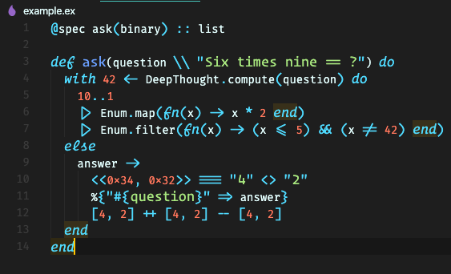

# Operator Mono w/Ligature Support for VSCode

This repository is meant to help you setup Operator Mono in VSCode. I went through many various guides to get this working so decided to put this repo up to help others interested in getting this working. I have only tested this on Mac OSX as this is what I'm currently using.

The fonts found in the font directory already include ligature support. Below is a list where I obtained the fonts and instructions to build them.

- Free Operator Mono Font: https://www.cufonfonts.com/font/operator-mono
- Build Ligature Fonts: https://github.com/kiliman/operator-mono-lig

Note: I am also using Fira Code font as my base font so if you want to clone my exact setup. Install Fira Code from https://github.com/tonsky/FiraCode

Here's my setup with some elixir code (example copied from Fira Code's example):



## Pre Setup

### Install Fonts

- Clone this repo and install the fonts into your system (usally double clicking will do this for you)

### Copy CSS

- Copy the included vscode_style.css somewhere on your machine.

## Setup VSCode

1. First you need to install the extension vscode-custom-css: https://github.com/be5invis/vscode-custom-css. 
2. Enable the extension 
3. Open your settings.json file and add the following:
 ```json
  ...
  "editor.fontFamily": "Fira Code", \\ You can specify a different base font here
    "editor.fontSize": 14,
    "editor.fontLigatures": true,
    "vscode_custom_css.imports": [
        "file:///<file_location>/vscode_style.css"
    ],
    "vscode_custom_css.policy": true
  ```
4. Open Command Pallet and run "Reload Custom CSS and JS"
5. Reload VSCode
6. Enjoy!

This should be all you need to get things up and running. If you have any issues I'll be glad to help.